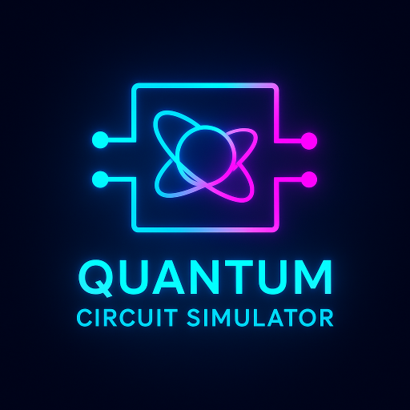

# Quantum Circuit Simulator

An interactive web application for building, simulating, and visualizing quantum circuits. It features a tap-and-place interface, a variety of quantum gates, real-time client-side simulation, and clear result visualizations.



---

## ✨ Features

- **Interactive Circuit Editor**: Easily build quantum circuits by selecting gates and placing them on qubit wires.
- **Multiple Qubits**: Simulate circuits with up to 5 qubits.
- **Rich Gate Palette**: Includes a variety of essential quantum gates:
  - **Single-Qubit Gates**: Hadamard (H), Pauli-X, Y, Z, Phase (S), and T gates.
  - **Multi-Qubit Gates**: Controlled-NOT (CNOT) and SWAP.
  - **Measurement**: A dedicated measurement operation (M).
- **Real-time Simulation**: The entire simulation runs instantly in your browser with no server-side backend.
- **Rich Result Visualization**:
  - **Probability Histogram**: View the measurement probabilities of each quantum state after a simulated 1024 shots.
  - **State Vector Display**: Inspect the final complex amplitudes of the system's state vector.
- **Gate Information Panel**: Hover over or select a gate to learn its name, description, and matrix representation.
- **Interactive Learning Hub**: A built-in "Learn" section provides hands-on tutorials for fundamental concepts like Superposition and Entanglement.
- **Responsive Design**: Fully functional on both desktop and mobile devices.
- **Powered by XIVIX**: A project developed under the XIVIX umbrella.

## 🚀 Getting Started

This is a React TypeScript application with Vite.

1.  **Clone the repository:**
    ```bash
    git clone https://github.com/XIVIX-Official/quantum-circuit-simulator.git
    ```

2.  **Navigate to the directory:**
    ```bash
    cd quantum-circuit-simulator
    ```

3.  **Install dependencies:**
    ```bash
    npm install
    ```

4.  **Start the development server:**
    ```bash
    npm run dev
    ```

5.  **Open the application:**
    - The development server will provide a local URL (typically `http://localhost:5173`)
    - Open this URL in your web browser
    
6.  **For production build:**
    ```bash
    npm run build
    npm run preview    # To preview the production build
    ```

## 📁 Project Structure

```
.
├── components/         # React components for UI elements
│   ├── CircuitBoard.tsx
│   ├── Gate.tsx
│   ├── GatePalette.tsx
│   ├── HistogramChart.tsx
│   ├── InfoPanel.tsx
│   ├── LearnScreen.tsx
│   ├── Logo.tsx
│   └── ResultsDisplay.tsx
├── lib/               # Utility libraries
│   └── complex.ts     # Complex number arithmetic
├── services/          # Core application logic
│   └── quantumSimulator.ts # The quantum simulation engine
├── App.tsx            # Main application component
├── constants.ts       # Gate properties, matrices, etc.
├── index.html         # Main HTML entry point
├── index.tsx         # React root renderer
├── vite.config.ts    # Vite configuration
├── tsconfig.json     # TypeScript configuration
├── package.json      # Project dependencies and scripts
├── metadata.json     # Application metadata
└── types.ts          # TypeScript type definitions
```

## 🛠️ How to Use

1.  **Select a Gate**: Tap a gate from the "Gates" palette.
2.  **Place the Gate**: Tap an empty cell on a qubit wire in the circuit board.
3.  **Place Multi-Qubit Gates**: For gates like CNOT, tap the *control* qubit wire first, then tap the *target* qubit wire on the same step.
4.  **Adjust Qubits**: Use the `+` and `-` buttons to change the number of qubits in the circuit.
5.  **Simulate**: Click the "Simulate" button to run your circuit.
6.  **View Results**: The "Results" panel will update with a histogram and the state vector. Use the toggle to switch between views.
7.  **Remove a Gate**: Right-click (on desktop) or long-press (on mobile) on a gate to remove it.
8.  **Learn**: Click "Learn with Examples" to explore tutorials on key quantum concepts.

## 📄 License

This project is open source and available under the [MIT License](LICENSE).

---
**Powered by XIVIX**